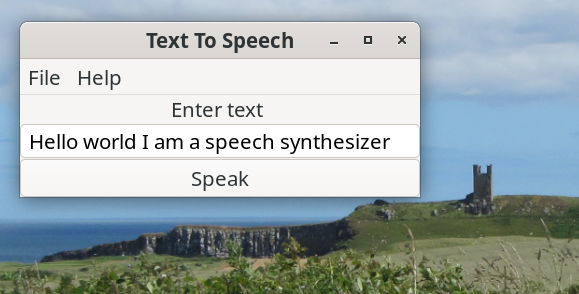

# Talker (Diphone Speech Synthesizer)

Talker is a diphone speech synthesizer. It has been developed using C and [GTK4](https://docs.gtk.org/gtk4/). A screenshot is shown below.

 

### Prebuilt Binary

A 64 bit prebuilt binary is available and can be downloaded from the binary folder. This has been built using Debian 12 Bookworm. Download and extract. The talker executable can be run from a terminal.

```
./talker
```

Talker must have executable permissions. Use the command below if necessary.

```
chmod +x talker
```
## Audio

I have used the Advanced Linux Sound Architecture (ALSA) library [aplay](https://alsa.opensrc.org/Aplay) program for audio output. If building a desktop from a Debian base install you will need to install the ALSA utilities as shown below but otherwise this is installed by default.

```
sudo apt install alsa-utils
```

## Sample Phrases

Pre-processing of input text is very limited at this stage just removing unwanted characters such as commas, exclamation marks and question marks. Some sample phrases for testing  the diphone speech synthesizer are shown below

```

Hello world I am a text to speech synthesizer

Mary had a little lamb, It's fleece was white as snow And everywhere that Mary went? The lamb was sure to go! 

Wishing you a happy birthday.

```
## How is Speech Generated?

Words are formed as sequences of elementary speech units. A phoneme is the smallest unit of sound that distinguishes one word from another word and there are 44 phonemes in the English language. A diphone is a sound unit composed of two adjacent partial phonemes i.e. the second half of the first phoneme and the first half of the second phoneme. 

This voice used by Talker is derivative work based on the diphone collection created by Alan W Black and Kevin Lenzo which is free for use for any purpose (commercial or otherwise) and subject to the pretty light restrictions detailed [here](https://github.com/hypnaceae/DiphoneSynth/blob/master/diphones_license.txt). I have used the same licence for the voice that I have created. There is information about recording your own diphones [here](http://festvox.org/bsv/x2401.html) and in the speech synthesis lecture given by Professor Alan W Black and found [here](https://www.youtube.com/watch?v=eDjtEsOvouM&t=1459s).

The diphone speech synthesizer uses a small dictionary of approximately 56,600 English words. If a word is not recognised by the dictionary it is skipped over. More words will be added in future updates.

## Build From Source

The C source code for talker is provided in the src directory.

With both  Debian Bookworm and Ubuntu and you need to install the following packages to build Talker.

```
apt install build-essential
apt install libgtk-4-dev
apt install libasound2-dev
```

The packages:

```
apt install libglib2.0-dev
apt install alsa-utils
```

are needed but should be installed by default.

Use the MAKEFILE to compile. 

```
make
```

To run Talker from the terminal use

```
./talker
```

I have used Geany for developing the code which is a lightweight source-code editor with an integrated terminal. I have been using the [Budgie desktop ](https://buddiesofbudgie.org/) with Debian 12 Bookworm. See acknowledgements below.

## Versioning

[SemVer](http://semver.org/) is used for versioning. The version number has the form 0.0.0 representing major, minor and bug fix changes.

## Author

* **Alan Crispin** [Github](https://github.com/crispinprojects)

## License

Talker is licensed under LGPL v2.1. 

## Project Status

Active.

## Acknowledgements

* [GTK](https://www.gtk.org/)

* GTK is a free and open-source project maintained by GNOME and an active community of contributors. GTK is released under the terms of the [GNU Lesser General Public License version 2.1](https://www.gnu.org/licenses/old-licenses/lgpl-2.1.html).

* [GTK4 API](https://docs.gtk.org/gtk4/index.html)

* [GObject API](https://docs.gtk.org/gobject/index.html)

* [Glib API](https://docs.gtk.org/glib/index.html)

* [Gio API](https://docs.gtk.org/gio/index.html)

* [Geany](https://www.geany.org/) is a lightweight source-code editor (version 2 now uses GTK3). [GPL v2 license](https://www.gnu.org/licenses/old-licenses/gpl-2.0.txt)

* Diphone collection and synthesis Alan W. Black and Kevin Lenzo [2000](https://www.cs.cmu.edu/~awb/papers/ICSLP2000_diphone.pdf) with license found [here](https://github.com/hypnaceae/DiphoneSynth/blob/master/diphones_license.txt)

* How to Install Budgie Desktop on Debian. See [here](https://www.linuxcapable.com/how-to-install-budgie-desktop-on-debian-linux/) and [here](https://packages.debian.org/bookworm/budgie-desktop).

